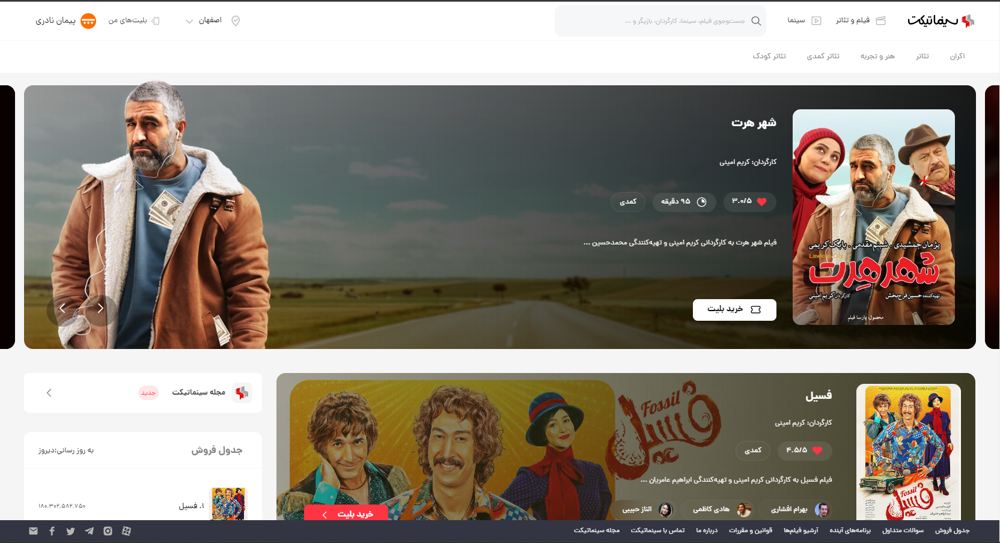

<div align="center">



</div>

The cinema ticket project encompasses both the back-end and front-end development, serving as a sample work rather than having any formal implications. The developers involved in this project have been challenged to utilize their expertise and deliver a valuable showcase of their skills.

Front-End:
 - Next.Js
 - Tailwind Css
 - Context
 - Axios
 - styled-components
 - nprogress
 - formik
 - headlessui

Back-End:
- TypeScript
- Node.js
- Express.js
- PostgreSQL
- Prisma
- Swagger
- Passport.js (local JWT).


#### Developing ...

---
### Priview 


To view it online, please click on the link below: [Priview Online (Comming soon ...)]()

---

### Setup the project on your localhost


To set up the project on your localhost, follow the steps below. Afterwards, you can utilize the project's back-end and test it accordingly:

#### 1) Clone Project

```shell
git clone https://github.com/peymanath/cinematicket.org
```

```shell
cd cinematicket.org
```

#### 2) Setup Project

```shell
npm run build
```

```shell
npm run start
```


#### 3) Setup Back-End

To set up the website's back-end, please refer to the following repository and thoroughly study the instructions on how to launch the back-end. Make sure to follow the provided guidelines for a successful setup:

[Repository Link](https://github.com/mahdiHash/cinemaTicket-server)

By carefully reviewing and implementing the instructions outlined in the repository, you will be able to successfully configure and run the back-end of the website.

MohammadGlp